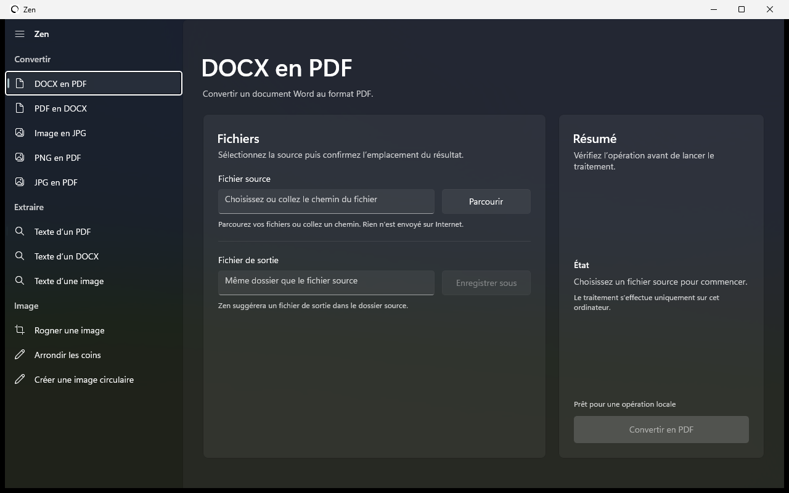

# Zen

Zen est une application Windows 11 native qui convertit et transforme des fichiers entièrement en local. Aucun document n’est envoyé sur Internet.



## Fonctionnalités

- Conversion PDF et DOCX
- Conversion d’images vers JPG ou PDF
- Extraction de texte depuis un PDF, un DOCX ou une image
- Rognage, coins arrondis et découpe circulaire

## Stack technique

- C# et .NET 8
- WinUI 3 avec Windows App SDK et effet Mica
- PdfPig pour la lecture des PDF et Open XML SDK pour les documents DOCX
- Tesseract OCR avec modèles français et anglais intégrés
- System.Drawing pour les conversions et transformations d’images
- Microsoft Word pour les conversions documentaires haute fidélité, avec LibreOffice comme solution de secours pour l’export PDF

Zen est publié en application Windows x64 autonome. Les traitements sont exécutés sur la machine, sans serveur, compte utilisateur, base de données ou connexion Internet.

## Utilisation

Télécharger la [dernière version de Zen](https://github.com/michel-DC/Zen-App/releases/latest), extraire l’archive puis lancer `Zen.exe`.

Les sources WinUI 3 sont disponibles dans [`winui`](winui).

## Compilation

```powershell
dotnet publish winui\Zen.WinUI.csproj -c Release -r win-x64 --self-contained true -o winui\publish
```
