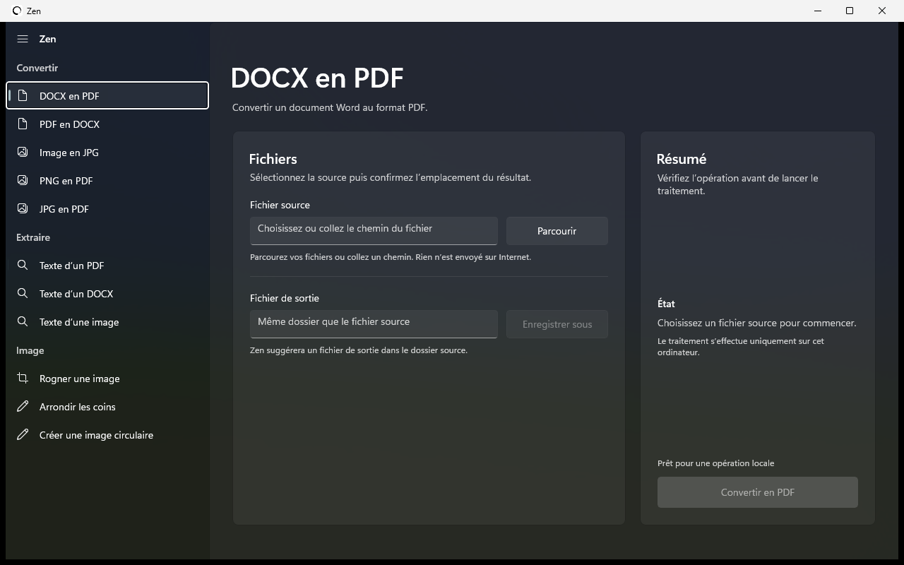

# Zen

Zen est une application Windows 11 native qui convertit et transforme des fichiers entièrement en local. Aucun document n’est envoyé sur Internet.



## Fonctionnalités

- Conversion PDF et DOCX, avec export PDF au format A4
- Conversion d’images vers JPG ou PDF A4
- Fusion de plusieurs PDF dans l’ordre choisi, avec toutes les pages au format A4
- Extraction de texte depuis un PDF, un DOCX ou une image
- Rognage, coins arrondis et découpe circulaire

## Stack technique

- C# et .NET 8
- WinUI 3 avec Windows App SDK et effet Mica
- PDFsharp pour la fusion et le format A4, PdfPig pour la lecture des PDF et Open XML SDK pour les documents DOCX
- Tesseract OCR avec modèles français et anglais intégrés
- System.Drawing pour les conversions et transformations d’images
- Microsoft Word pour les conversions documentaires haute fidélité, avec LibreOffice comme solution de secours pour l’export PDF

Zen est publié en application Windows x64 autonome. Les traitements sont exécutés sur la machine, sans serveur, compte utilisateur, base de données ou connexion Internet.

## Utilisation

Télécharger la [dernière version de Zen](https://github.com/michel-DC/Zen-App/releases/latest), extraire l’archive puis lancer `Zen.exe`.

Dans **Fusionner des PDF**, ajoutez au moins deux fichiers, organisez la liste avec **Monter**, **Descendre** et **Retirer**, puis lancez **Fusionner les PDF**. Le résultat est enregistré dans le dossier du premier PDF, sauf emplacement choisi avec **Enregistrer sous**.

Les noms de sortie sont proposés automatiquement sans mention de Zen ; un numéro est ajouté si le nom existe déjà. Un nom choisi manuellement reste celui que vous avez saisi.

Les sources WinUI 3 sont disponibles dans [`winui`](winui).

## Installation Windows

Depuis un dossier contenant la distribution `Zen-Windows11`, exécuter :

```powershell
powershell -ExecutionPolicy Bypass -File installer\Install-Zen.ps1
```

Zen est alors installé pour l’utilisateur courant, ajouté au menu Démarrer et enregistré dans les Applications installées de Windows.

## Compilation

```powershell
dotnet publish winui\Zen.WinUI.csproj -c Release -r win-x64 --self-contained true -o winui\publish
```
